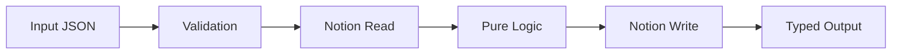

## Overview

The jre-notion-workers system is built on a clean, layered architecture that separates pure business logic from I/O operations. This design ensures testability, maintainability, and predictable behavior.

## Core Design Principles

Every component in the system adheres to these fundamental principles:

<CardGroup cols={2}>
  <Card title="Single Responsibility" icon="crosshairs">
    One worker (tool) does one thing. Each worker has a clear, focused purpose.
  </Card>
  <Card title="Pure Logic Core" icon="flask">
    Parsing, formatting, and validation are I/O-free and unit-testable.
  </Card>
  <Card title="Thin I/O Shell" icon="shield">
    Notion API calls are isolated in worker `execute` functions or shared helpers.
  </Card>
  <Card title="Typed Contracts" icon="file-contract">
    Every worker has explicit `*Input` and `*Output` types in `src/shared/types.ts`.
  </Card>
</CardGroup>

<Note>
  **Fail Fast Philosophy**: Validate all inputs at the start of `execute`. Return `{ success: false, error }` instead of throwing exceptions.
</Note>

## Layered Structure

The system is organized into four distinct layers, each with a specific responsibility:

```
┌─────────────────────────────────────────┐
│  Entry (src/index.ts)                    │
│  Registers tools with Worker, schemas,   │
│  and execute → worker.execute(input, ctx)│
└─────────────────────────────────────────┘
                    │
┌─────────────────────────────────────────┐
│  Workers (src/workers/*.ts)             │
│  Validate input, call shared logic,     │
│  call Notion via passed client, return  │
└─────────────────────────────────────────┘
                    │
┌─────────────────────────────────────────┐
│  Shared (src/shared/*.ts)               │
│  Pure: status-parser, date-utils,        │
│  agent-config, block-builder.            │
│  I/O: notion-client (env + Client)      │
└─────────────────────────────────────────┘
                    │
┌─────────────────────────────────────────┐
│  Types (src/shared/types.ts)            │
│  Input/output interfaces, no logic      │
└─────────────────────────────────────────┘
```

### Layer Responsibilities

<AccordionGroup>
  <Accordion title="Entry Layer (src/index.ts)">
    The entry point registers all tools with the Notion Worker runtime:
    
    ```typescript
    import { Worker } from "@notionhq/workers";
    import { executeWriteAgentDigest } from "./workers/write-agent-digest.js";
    
    const worker = new Worker();
    
    worker.tool("write-agent-digest", {
      title: "Write Agent Digest",
      description: "Creates a governance-compliant agent digest page",
      schema: writeDigestSchema,
      execute: (input, context) => executeWriteAgentDigest(input, context.notion),
    });
    ```
    
    This layer defines tool schemas and maps inputs to worker functions.
  </Accordion>

  <Accordion title="Workers Layer (src/workers/)">
    Workers orchestrate the entire operation:
    
    1. **Validate input** - Check required fields and allowed values
    2. **Call shared logic** - Use pure functions for transformations
    3. **Execute Notion API calls** - Read or write data via the client
    4. **Return typed output** - Structured success or error responses
    
    Workers never contain business logic - they coordinate.
  </Accordion>

  <Accordion title="Shared Layer (src/shared/)">
    The shared layer contains two types of modules:
    
    **Pure modules** (no I/O):
    - `status-parser.ts` - Parse and build status lines
    - `date-utils.ts` - Date formatting and business day calculations
    - `agent-config.ts` - Agent validation and digest patterns
    - `block-builder.ts` - Notion block construction
    
    **I/O modules**:
    - `notion-client.ts` - Client initialization from environment
  </Accordion>

  <Accordion title="Types Layer (src/shared/types.ts)">
    Contains all TypeScript interfaces and type definitions:
    
    ```typescript
    export type StatusType = "sync" | "snapshot" | "report" | "heartbeat";
    export type StatusValue = "complete" | "partial" | "failed" | "full_report" | "stub";
    
    export interface WriteAgentDigestInput {
      agent_name: string;
      agent_emoji: string;
      status_type: StatusType;
      status_value: StatusValue;
      // ... more fields
    }
    ```
    
    This layer contains zero logic - only type declarations.
  </Accordion>
</AccordionGroup>

## Data Flow

Data flows unidirectionally through the system:



<Steps>
  <Step title="Input">
    Caller sends JSON matching the tool schema (e.g., `agent_name`, `status_type`).
  </Step>
  
  <Step title="Validation">
    Worker checks required fields and allowed values (e.g., `VALID_AGENT_NAMES`) and returns an error object if invalid.
    
    ```typescript
    if (!VALID_AGENT_NAMES.includes(input.agent_name)) {
      return { success: false, error: `Invalid agent_name: ${input.agent_name}` };
    }
    ```
  </Step>
  
  <Step title="Notion Read (if needed)">
    For operations like `check-upstream-status` or `create-handoff-marker`, the worker queries databases or blocks via the Notion client.
  </Step>
  
  <Step title="Pure Logic">
    Shared modules parse status lines, build titles, build blocks, compute dates - all without I/O.
    
    ```typescript
    const statusLine = buildStatusLine(input.status_type, input.status_value);
    const title = buildPageTitle({ emoji, digestType, date, isError });
    const blocks = buildDigestBlocks(contentLines);
    ```
  </Step>
  
  <Step title="Notion Write (if needed)">
    Worker creates or updates pages/blocks (`write-agent-digest`, `create-handoff-marker`).
  </Step>
  
  <Step title="Output">
    Worker returns a typed object:
    
    ```typescript
    return {
      success: true,
      page_url: "https://notion.so/...",
      page_id: "abc123...",
      title: "📧 Email Triage — 2026-03-04",
      is_error_titled: false,
      is_heartbeat: false,
    };
    ```
  </Step>
</Steps>

## Worker Responsibilities

Each worker has a defined scope:

| Worker | Reads from Notion | Writes to Notion | Shared Modules Used |
|--------|-------------------|------------------|---------------------|
| `write-agent-digest` | — | Docs or Home Docs | `agent-config`, `status-parser`, `date-utils`, `block-builder` |
| `check-upstream-status` | Docs, Home Docs | — | `agent-config`, `status-parser`, `date-utils` |
| `create-handoff-marker` | Docs (optional) | Tasks (optional) | `agent-config`, `date-utils` |

<Info>
  See the [Workers Reference](/workers/write-agent-digest) for detailed documentation on each worker's inputs, outputs, and behavior.
</Info>

## Idempotency and Guards

<AccordionGroup>
  <Accordion title="write-agent-digest">
    Creates one page per call. Idempotency is the caller's responsibility - typically one digest per agent per run.
  </Accordion>

  <Accordion title="check-upstream-status">
    Read-only operation. Inherently idempotent.
  </Accordion>

  <Accordion title="create-handoff-marker">
    Implements two safety mechanisms:
    
    **Circuit Breaker**: Prevents duplicate handoffs for the same source→target within 7 days.
    
    **Re-escalation Cap**: Maximum of 2 escalations in the same direction within 7 days. After that, sets `needs_manual_review` flag.
    
    ```typescript
    const HANDOFF_WINDOW_DAYS = 7;
    const ESCALATION_CAP = 2;
    
    if (existingOpen.length > 0) {
      return {
        success: true,
        duplicate_prevented: true,
        existing_task_url: existingTaskUrl,
        // ...
      };
    }
    ```
  </Accordion>
</AccordionGroup>

## Error Handling

The system follows a strict error handling pattern:

<CardGroup cols={2}>
  <Card title="Validation Errors">
    Return structured errors:
    ```typescript
    { 
      success: false, 
      error: "descriptive message" 
    }
    ```
  </Card>
  
  <Card title="Notion API Errors">
    Catch in try/catch, return structured error:
    ```typescript
    catch (e) {
      const message = e instanceof Error 
        ? e.message 
        : String(e);
      return { 
        success: false, 
        error: message 
      };
    }
    ```
  </Card>
</CardGroup>

<Warning>
  **No Silent Failures**: Every failure path returns a structured error to the caller. Workers never throw exceptions.
</Warning>

## Dependencies

The system relies on three core dependencies:

- **@notionhq/client** — Notion API client
- **@notionhq/workers** — Worker runtime and registration (`Worker`, `.tool()`)
- **date-fns** — Date formatting and parsing (Chicago time, age checks)

All configuration (tokens, database IDs) comes from `process.env` via `src/shared/notion-client.ts`.

## Module System

The project uses ES Modules (ESM):

```typescript
// ✅ Correct - use .js extension in imports
import { getNotionClient } from "../shared/notion-client.js";

// ❌ Wrong - missing extension
import { getNotionClient } from "../shared/notion-client";
```

<Note>
  Import paths require `.js` extensions even when importing from `.ts` files due to the `NodeNext` module resolution.
</Note>

## Next Steps

<CardGroup cols={2}>
  <Card title="Agent System" icon="users" href="/concepts/agent-system">
    Learn about the 11-agent system and digest patterns
  </Card>
  <Card title="Governance" icon="shield-check" href="/concepts/governance">
    Understand the rules and boundaries that keep the system safe
  </Card>
  <Card title="API Reference" icon="code" href="/workers/write-agent-digest">
    Detailed documentation for each worker
  </Card>
  <Card title="Quick Start" icon="rocket" href="/quickstart">
    Get started with your first integration
  </Card>
</CardGroup>